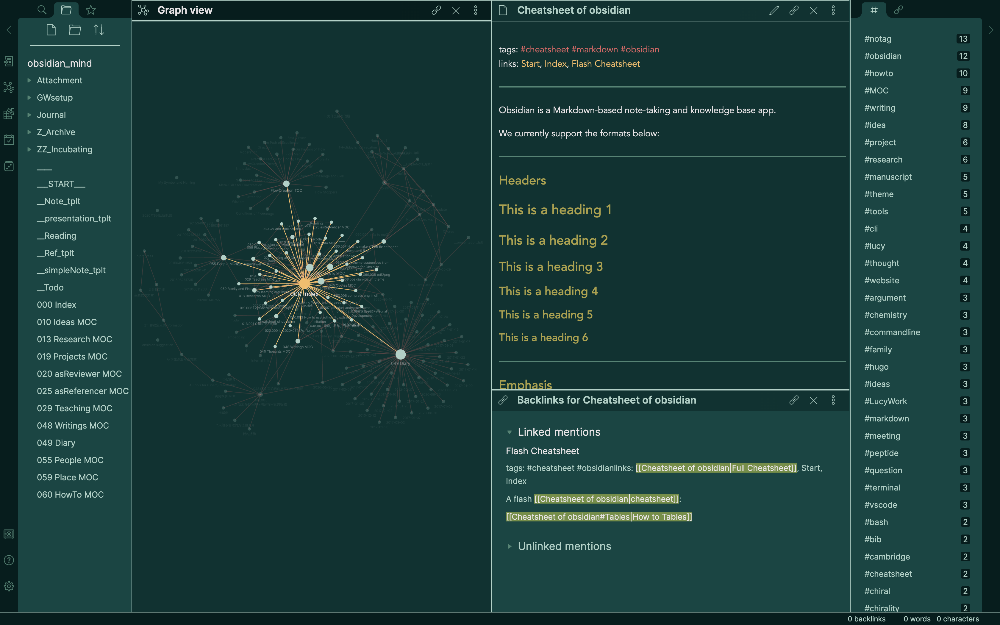
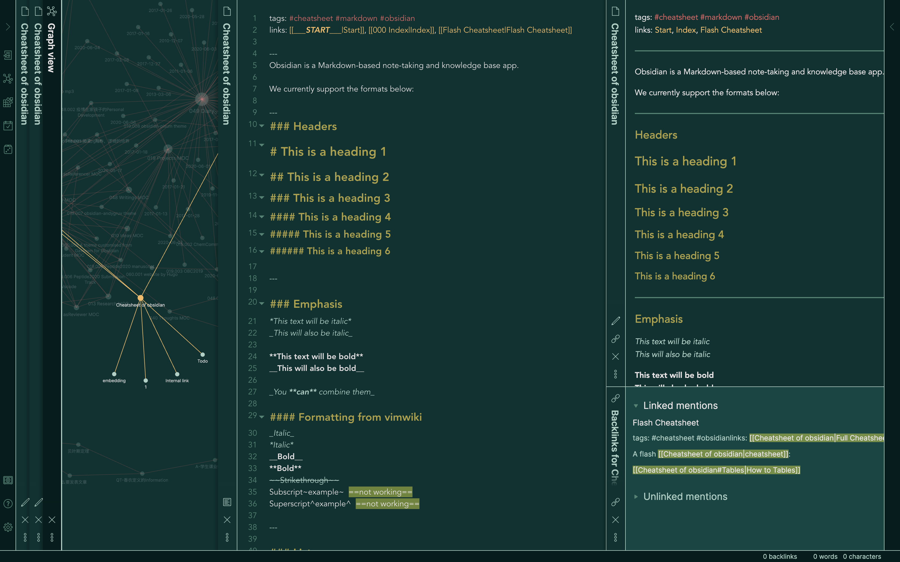

# Obsidian-pisum

This is an [obsidian](https://obsidian.md/) theme with clean line-drawing appearance. Only dark mode is available, but I set the light mode to be an [Andy_Matuschak mode](https://notes.andymatuschak.org) which is a credit to [death_au](https://github.com/deathau) 's brilliant solution. 

~~Be careful! Almost all scrollbars are removed for a non-distracted interface.~~

---
### Screenshot

---
### Usage

- Turn on 'Custom CSS' plugin in Obsidian: `Settings > Plugins >  Custom CSS`.
- Download and copy the  `obsidian.css` file to the vault directory of your Obsidian note. It should take effect immediately.
- Switch between dark and light mode:  `Settings > Apprearance > Theme`.
- Happy writing and have fun!
