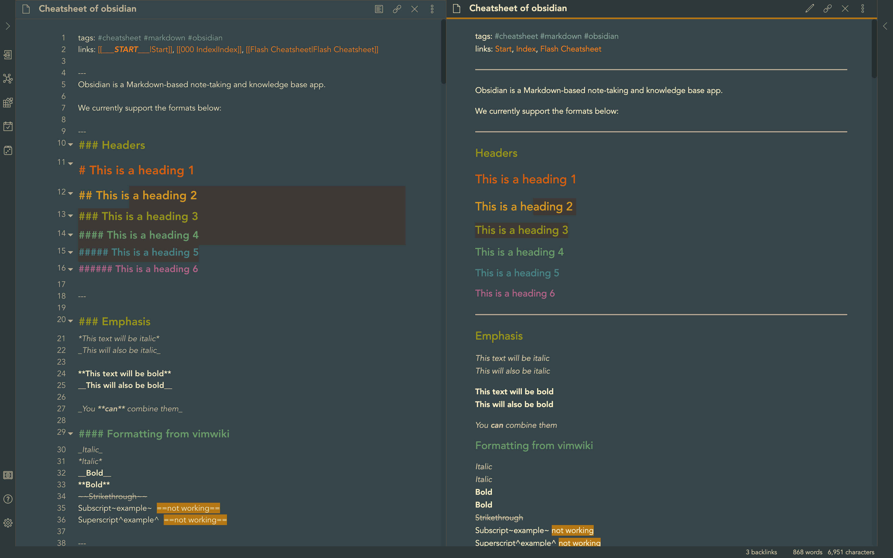
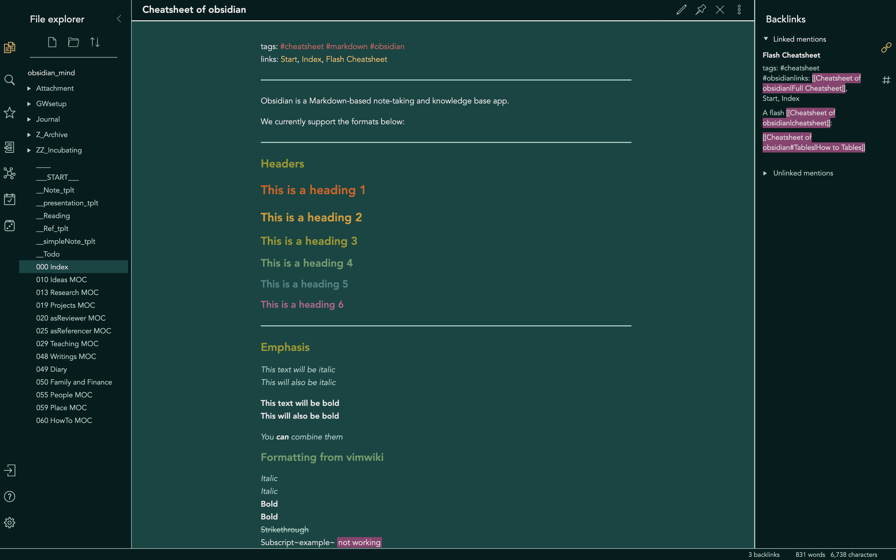

# Obsidian-pisum

This is an [obsidian](https://obsidian.md/) theme with clean line-drawing appearance. Only dark mode available. 

---
### Screenshot

---
### Usage

- Download and copy the  `obsidian.css` file to the vault directory of your Obsidian note. It should take effect immediately.
- Turn on 'Custom CSS' plugin in Obsidian: `Settings > Plugins >  Custom CSS`.
- Switch between dark and light mode:  `Settings > Apprearance > Theme`.
- Happy writing and have fun!
